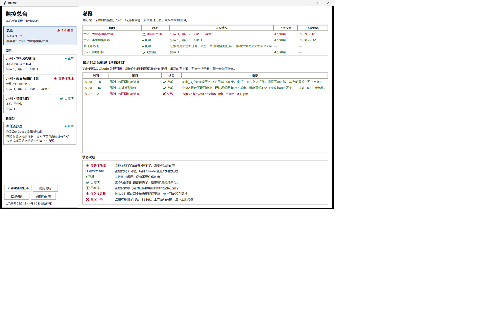
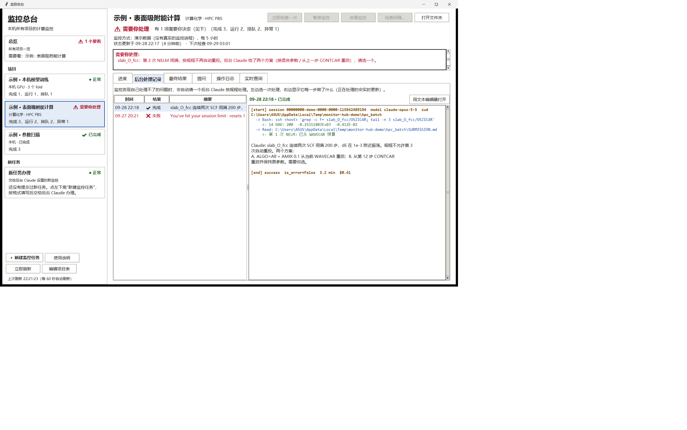
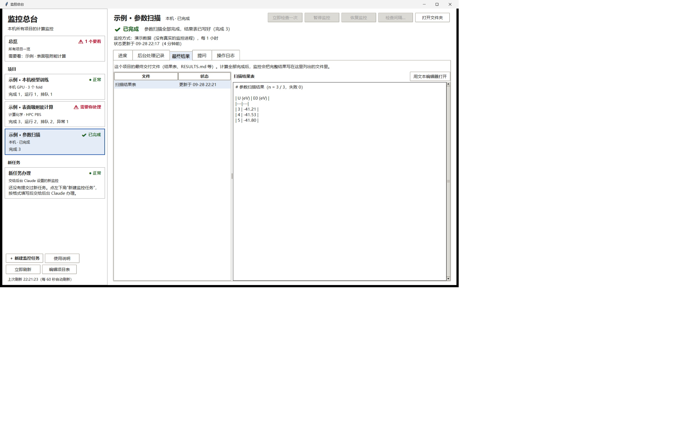
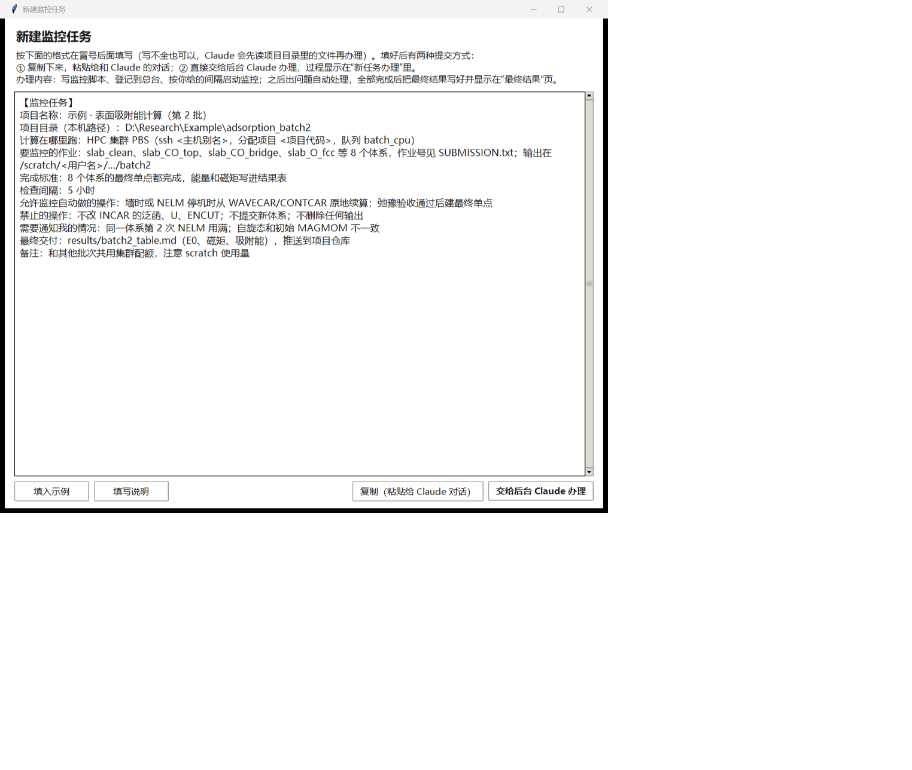

# Monitor · 监控总台

一个 Windows 桌面小程序，把本机上所有长时间计算任务的监控集中到一个窗口里。任务可以在本机跑（机器学习训练、数据处理），也可以在 HPC 集群的 PBS 上跑（VASP 等）。在这个窗口里你可以：

- **看完成情况**：每个项目一张卡片，状态一眼看清（⚠ 需要你处理 / ⟳ 后台处理中 / ● 正常 / ✔ 已完成 / ⏸ 已暂停）。进度表支持任务下钻：新格式监控提供 `row_meta` 后，双击一行可直接打开该任务目录、日志或结果文件。
- **看后台 Claude 的处理过程**：监控发现自己处理不了的问题时，会启动一个无头 Claude（`claude -p`）按规程处理。它读了什么、运行了什么命令、得到什么结果，都能实时看到。
- **看最终结果**：计算全部完成后，结果表和 RESULTS.md 直接在窗口里打开。
- **提问**：用中文问这个项目的情况。提问会话是真正只读的（只能读文件，不能运行命令、不能改文件）。
- **管理监控**：立即检查一次、暂停、恢复、修改检查间隔。
- **提交新的监控任务**：按固定格式填写，交给后台 Claude 办理（写监控脚本 → 登记到总台 → 启动 → 出问题自动处理 → 全部完成后交付最终结果）。



| 项目页：需要你处理 + 后台处理记录 | 最终结果 | 新建监控任务 |
|---|---|---|
|  |  |  |

（截图用的是 `tests/demo/make_demo.py` 生成的演示数据。）

## 工作方式

总台本身**不做监控**，它只是查看器和控制面板：

1. **各项目的监控**独立运行，用 Windows 定时任务或本机后台循环。确定性脚本负责能按规程做的机械操作（续算、重投、汇总），并把状态写成文件。
2. 遇到它决定不了的事（ATTENTION），启动**无头 Claude 接管**，处理过程用 stream-json 记录下来。
3. **总台**读取这些文件和系统状态（Task Scheduler COM、WMI），在界面上显示出来。刷新时不启动任何子进程，所以不会闪出命令行窗口。

所以关掉总台不影响任何监控；把总台改写成别的语言，也不用改任何监控。详见 [docs/ARCHITECTURE.md](docs/ARCHITECTURE.md)。

## 运行

需要 Windows 10/11，Python 3.12（带 tkinter 和 pywin32），以及 Claude Code CLI（`claude.exe`）。

```
copy hub\monitor_hub_projects.example.json hub\monitor_hub_projects.json   # 然后改成你的项目
pythonw hub\monitor_hub.py
```

- 程序顶部的常量（`CLAUDE`、`PWSH`、`HUB_DATA`、`DETACH`）是作者机器上的路径，换机器时要改。
- 定时任务的启动程序必须写成 `conhost.exe --headless powershell.exe …`，否则会闪窗（见 [docs/LESSONS_LEARNED.md](docs/LESSONS_LEARNED.md) A2）。
- 新监控写出的状态文件格式：[hub/hub_status.schema.json](hub/hub_status.schema.json)。每行任务可带 `table.row_meta` 供总台打开具体任务和读取参数。
- 可直接照抄的完整状态示例：[hub/hub_status.example.json](hub/hub_status.example.json)。新 monitor 建议写 `schema_version: 1`。
- 新监控脚本 / 定时任务的机器可读命名规范见 [docs/MONITOR_NAMING.md](docs/MONITOR_NAMING.md)。
- 界面把运行状态与帮助文案分开：状态常驻，说明性文字使用按钮 hover tooltip；规则见 [docs/UI_GUIDELINES.md](docs/UI_GUIDELINES.md)。

不想碰真实项目、只想先看效果：
```
python tests\demo\make_demo.py
set MONITOR_HUB_REGISTRY=%TEMP%\monitor-hub-demo\demo_projects.json
set MONITOR_HUB_DATA=%TEMP%\monitor-hub-demo\hubdata
set MONITOR_HUB_NO_DISCOVERY=1
python hub\monitor_hub.py
```

## 目录

```
hub/
  monitor_hub.py                    主程序（界面 + 读取 + 管理 + 提问 + 新任务办理）
  claude_stream.py                  stream-json 接管记录的解析和渲染（QoI 监控也在用）
  monitor_hub_README.md             用户使用说明（窗口里的「使用说明」）；第 9 节是给 Claude 的执行规范
  hub_status.schema.json            通用状态文件格式
  monitor_hub_projects.example.json 登记表示例（真实登记表 monitor_hub_projects.json 不进仓库）
deps/cdesktop-detach.ps1            启动不受 cdesktop 会话影响的后台作业（副本；程序使用 ~/.claude/tools 下的那一份）
docs/
  ARCHITECTURE.md                   模块、数据约定、健康判定、线程、安全边界
  PORTING_TO_CPP.md                 改写为 C++ 的指南：技术栈、逐函数对照、实施顺序、对照测试
  LESSONS_LEARNED.md                开发中遇到的错误和难题，以及怎么解决的
  images/                           截图（演示数据）
tests/                              演示数据、页面巡览截图、COM / 后台作业 / 适配器 / 新任务办理测试（见 tests/README.md）
```

## 改写成 C++

计划用 C++（建议 Qt 6 + nlohmann/json + Task Scheduler COM + WMI）重写。[docs/PORTING_TO_CPP.md](docs/PORTING_TO_CPP.md) 给出了：
- 逐个函数的对照表；
- 必须保留的行为（不闪窗、只读提问的参数、健康判定的优先级、界面配色和字号）；
- 对照测试的方法：两个版本都在演示数据上运行 `--dump`，逐字段比较。

## 关于这个项目

这个项目由 **Claude**（Anthropic 的 AI 助手；模型 Claude Opus 5.5，在 Claude Code 中运行）在 2026-09-28 按 Tony 的要求编写。起点是修复一个 QoI 计算监控脚本里的问题，后来一步步扩展成覆盖本机和 HPC 计算的通用监控总台。开发过程中踩过的坑都记录在 [docs/LESSONS_LEARNED.md](docs/LESSONS_LEARNED.md)，其中包括：
- MSIX 虚拟化路径导致 venv 启动失败；
- Windows Terminal 下定时任务闪窗；
- 管道编码导致的乱码；
- 所谓"只读"会话其实能写文件、能推送；
- Claude 额度共享导致后台任务中断。

所有功能都在作者的机器上实测过（截图、临时定时任务、临时后台作业、真实的后台 Claude 办理），测试脚本在 `tests/` 里。

目前未指定开源许可证。
